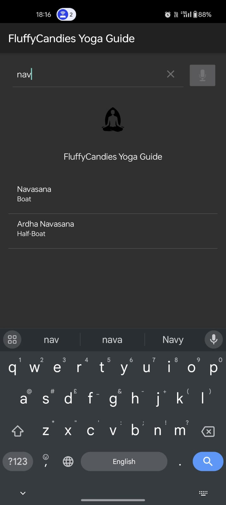
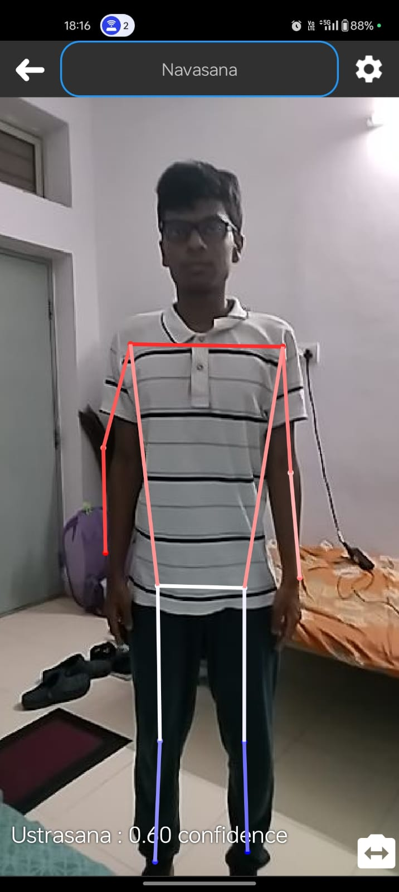

# FluffyCandies Yoga Posture Guidance

An ML-Powered Yoga Posture Guide

## Introduction

This app is intended to help individuals practice yogasanas from the comfort of their homes, while receiving visual feedback about their performance and measures for tracking their improvement.
We implement a real-time feedback mechanism and a means to correct the user’s posture when a yoga pose is performed, keeping in mind the user’s convenience. Our solution requires only a functional 
Android mobile device, which makes it available for a wide variety of users. We have implemented features such as voice search and a countdown timer, and used a database compiled from both online 
sources as well as data gathered on campus as well.

## Installation

The latest compiled APK is available for download on [our website](https://s0han24.github.io/FluffyCandiesYogaGuide/)

To compile from source, clone this repository, build it in Android Studio and run

## Usage

The UI is very intuitive and user-friendly. To use:

- Open the app and click on the start button, and you will be greeted with this screen
 

- Choose the required pose from the list (you can use the search button at the top left or voice search at the top right)

- Click on the continue button on the page that shows up

- You can now set up your phone such that you are in the frame, and toggle between using the front and back camera with the button at the bottom right

## Demo

[demo_video.mp4](demos/demo_video.mp4)

